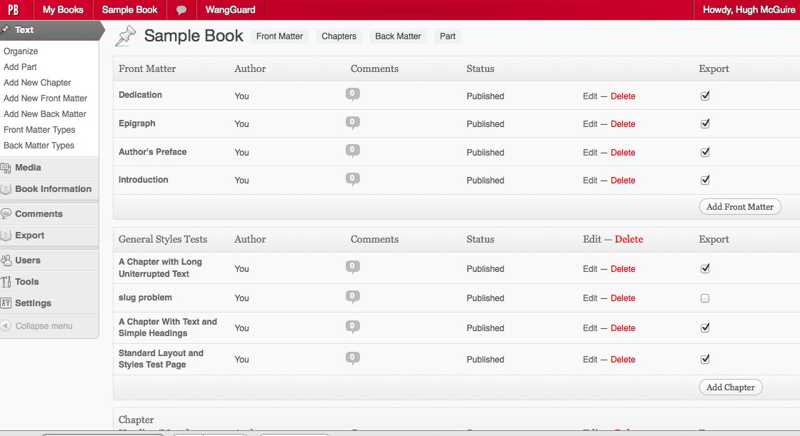

% Open Source für Verlage
% Pub 'n' Pub Freiburg
% 10. April 2014, Titusz Pan

# Software

## Grundlagen

> - Autoren
> - Sprachen
> - Übersetzer
> - Bibliotheken

## Autoren

schreiben Programme in verschiedenen ...

## Sprachen

wie etwa C, C++, Java, Python, Javascript, PHP...\
Diese lesbaren, formalen Hochsprachen werden von einem ...

## Übersetzer

auch Compiler oder Interpreter genannt, in unlesbare Maschinensprache (Binärcode)
übersetzt.

## Bibliotheken

sind Sammlungen bestehender Unterprogramme, die Lösungswege für spezifische
Problemstellungen auf unterschiedlichen Abstraktionsebenen bieten.

# Open Source

## Definition

> Open Source bzw. quelloffen ist Software, deren Quelltext offenliegt ...
[Wikipedia](http://de.wikipedia.org/wiki/Open_Source)

Im Gegensatz zu "propietär":

Quellcode liegt nur dem Hersteller vor.

## Überzeugungstäter

## Herkunft

Der Begriff "Open Source" wurde im April 1998 auf der "Freeware Summit" geprägt.
Eine Veranstaltung, organisiert vom dem Verleger Tim O´Reilly.

## Lizenzen

- MIT, BSD, Apache, GPL...
- Copyleft
- Haftungsausschluss

## Eigenschaften

- Beteiligung diverser Personen/Firmen
- Kein Vendor-Lock-in
- Nutzung an keine oder wenige Bedingungen geknüpft
- Prüfbarkeit der Software (Robustheit, Wartbarkeit, Sicherheit...)
- Fördert offene Standards (Interoperabilität)
- Geringere Kosten

# Für Verlage

## Situation

Es gibt leider kaum professionelle und  speziell auf die Bedürfnisse von
Verlagen zugeschnittene Open Source Software.

## Textverarbeitung

[LibreOffice](http://libreoffice.org/) / [OpenOffice](http://www.openoffice.org)

## DTP

Desktop Publishing - [Scribus](http://www.scribus.net/canvas/Scribus)

## Illustration

Vektorgrafik Programm - [Inkscape](http://www.inkscape.org/)

## Content Management

Auf Wordpress basierendes CMS - [Pressbooks](http://pressbooks.com/)

## Content Management

Auf Django basierendes CMS - [Booktype](http://www.sourcefabric.org/en/booktype/)

## E-Book Editing

EPUB™ Editor - [Sigil](https://code.google.com/p/sigil/)

## E-Book Editing

EPUB™ Editor - [BlueGriffon](http://www.bluegriffon-epubedition.com/BGEE.html)

## E-Book Management

Eierlegende Wollmilchsau - [Calibre](http://calibre-ebook.com/)

## Pandoc

Diese Präsentation wurde mit [Pandoc](http://johnmacfarlane.net/pandoc/) erstellt\
[Markdown Quelltext](https://raw.githubusercontent.com/titusz/osfv/master/osfv.md)

## Ausblick

Verlage sollten sich stärker vernetzen und für branchenspezifische Open
Source Projekte einsetzen.
